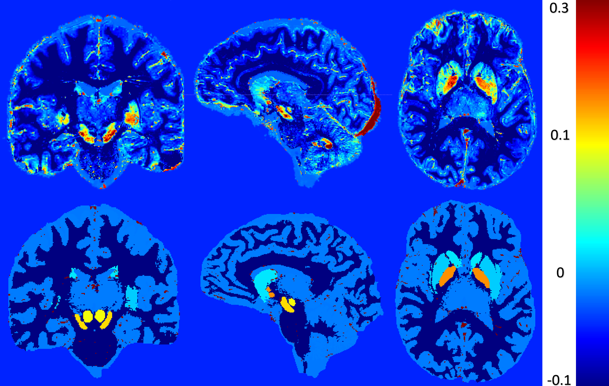

# Validation χ-separation using phantom simulations

## About Me

Hello everyone, my name is Daniel Ridani. I am a first-year PhD student at Polytechnique Montreal, majoring in biomedical engineering. I did my Bachelor's in general physics and my Masters in biomedical engineering, where I fell in love with this field and decided to pursue a PhD. Currently, I am working on quantitative MRI, specifically quantitative susceptibility mapping (QSM). In my research, I focus on studying the susceptibility contributions from iron and myelin and developing methods to effectively separate them. Brain Hack School has given me the opportunity to improve my Python skills and explore new topics such as deep learning and machine learning.

## Project Summary

### Introduction

My project aims to validate χ-separation algorithm using realistic in silico head phantom simulation. Susceptibility denoted as (χ), is a measure of how easily a material can be magnetized in response to an external magnetic field. Positive susceptibility implies that the material aligns its magnetization parallel to the main field, while negative susceptibility indicates an opposing alignment. The main two sources of χ are myelin (χ<0) and iron (χ>0) and they co-exist in almost every region in the human brain. Using the χ we can generate maps known as Quantitative susceptibility mapping (QSM) which does not have a ground truth. In the absence of ground truth for QSM, effort have been made (QSM reconstruction challenge 2.0) to create a phantom that can serve as a reference standard for validation. QSM measure the total χ rather than the distinct positive and negative χ sources, hence, to address this, χ-separation techniques, are employed to separate the two χ sources. The aforementioned phantom can be utilized to validate the accuracy of the χ-separation results.

### Main Objectives
- Get more familiar with χ-separation limitation.
- Validate χ-separation algorithm using ground truth data (phantom simulations).
- Implement python scripts to analyze and visualize the results.
- Create a GitHub repo to share my results.

### Personal Objectives
- Gain a deeper undersating of susceptibility contribution in the human brain.
- Develop the skill to manage a small project in a short period of time.
- Improve my programming skill using the BrainHack school modules.
- Share my knowlege with other to encourge open science.

### Tools
- χ-separation GUI developped by Hyeong-Geol Shin et al.
- QSM reconstruction challenge 2.0 code for GRE simulations of custom phantoms.
- Git and Github for Version Control
- Pyhton Packages: "matplotlib", "seaborn", "pandas"
### Data
The dataset used in this study was simulated using the matlab code from QSM reconstruction challenge 2.0 article developed by José P.Marques et al. This artciles also provided susceptibility values for 10 different region in the brain.

A summary of the susceptibility values is as follows:

|Brain Regions |Susceptibility (ppm)|
|:---------------|:----------------:|
|Caudate Nucleus |0.044             |
|Globus Pallidus |0.1305            |
|Putamen         |0.038             |
|Red Nucleus     |0.1               |
|Dentate Nucleus |0.152             |
|Substania Nigra |0.111             |
|Thalamus        |0.02              |
|White Matter    |-0.03             |
|Grey Matter     |0.02              |
|CSF             |0.019             |

### Project Deliverables

At the end of this project, we will have:
- A pahntom for χ-separation used as a ground truth.
- Detailed project workflow documented in a GitHub repository.
- Executable pyhton scipts for data visualization and analysis.
- Markdown file providing comprehensive project details.

## Results

### Progress overview

The project was swiftly initiated by P Bellec, based on the existing template created in 2019 by Tristan Glatard and improved by different students. It was really not that hard. Community feedback is expected to lead to rapid further improvements of this first version.

### Tools I learned during this project

 * **Meta-project** P Bellec learned how to do a meta project for the first time, which is developping a framework while using it at the same time. It felt really weird, but somehow quite fun as well.
 * **Github workflow-** The successful use of this template approach will demonstrate that it is possible to incorporate dozens of students presentation on a website collaboratively over a few weeks.
 * **Project content** Through the project reports generated using the template, it is possible to learn about what exactly the brainhack school students are working on.

### Results

#### Deliverable 1: report template

You are currently reading the report template! I will let you judge whether it is useful or not. If you think there is something that could be improved, please do not hesitate to open an issue [here](https://github.com/PSY6983-2021/project_template/issues/) and let us know.

#### Deliverable 2: project gallery

You can check out the [2020 BrainHack School project gallery](https://psy6983.brainhackmtl.org/project/)

##### ECG pupilometry pipeline by Marce Kauffmann

The repository of this project can be found [here](https://github.com/mtl-brainhack-school-2019/ecg_pupillometry_pipeline_kaufmann). The objective was to create a processing pipeline for ECG and pupillometry data. The motivation behind this task is that Marcel's lab (MIST Lab @ Polytechnique Montreal) was conducting a Human-Robot-Interaction user study. The repo features:
 * a [video introduction](http://www.youtube.com/watch/8ZVCNeX42_A) to the project.
 * a presentation [made in a jupyter notebook](https://github.com/mtl-brainhack-school-2019/ecg_pupillometry_pipeline_kaufmann/blob/master/BrainHackPresentation.ipynb) on the results of the project.
 * Notebooks for all analyses.
 * Detailed requirements files, making it easy for others to replicate the environment of the notebook.
 * An overview of the results in the markdown document.

##### Other projects
Here are other good examples of repositories:
- [Learning to manipulate biosignals with python](https://github.com/mtl-brainhack-school-2019/franclespinas-biosignals) by François Lespinasse
- [Run multivariate anaylysis to relate behavioral and electropyhysiological data](https://github.com/mtl-brainhack-school-2019/PLS_PV_Behaviour)
- [PET pipeline automation and structural MRI exploration](https://github.com/mtl-brainhack-school-2019/rwickens-sMRI-PET) by Rebekah Wickens
- [Working with PSG [EEG] data from Parkinson's patients](https://github.com/mtl-brainhack-school-2019/Soraya-sleep-data-in-PD-patients) by Cryomatrix
- [Exploring Brain Functional Activation in Adolescents Who Attempted Suicide](https://github.com/mtl-brainhack-school-2019/Anthony-Gifuni-repo) by Anthony Gifuni

#### Deliverable 3: Instructions

 To be made available soon.

## Conclusion 

### How can we validate χ-separation algorithm?

### Objectives, Tools, and Deliverables

### Detailed guide to Reproducibility

## Acknowledgments

## References
