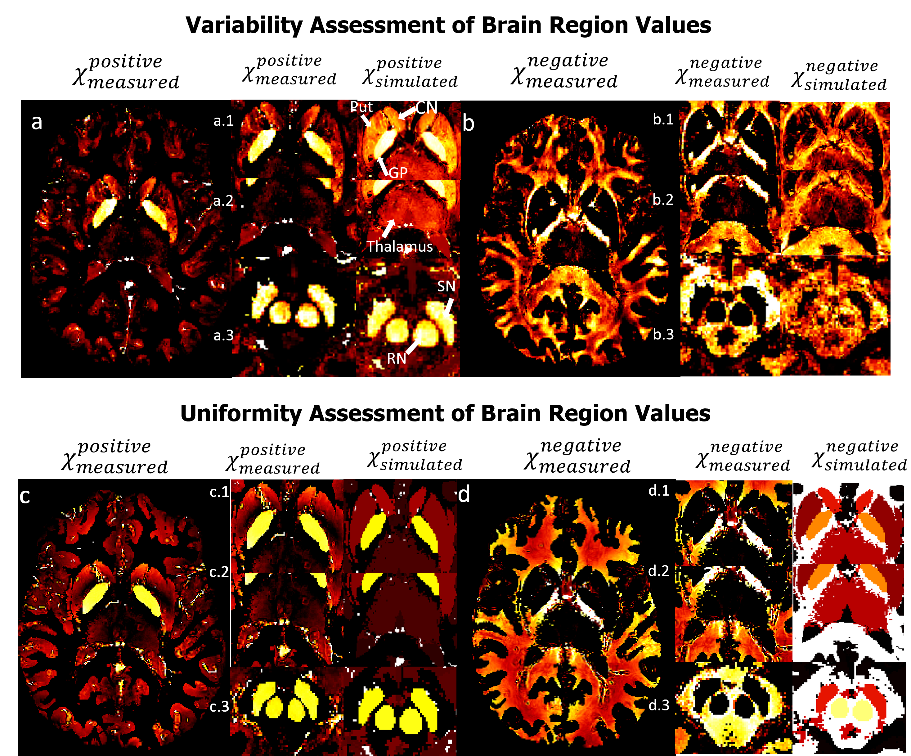

# Validation χ-separation using phantom simulations

## About Me

Hello everyone, my name is Daniel Ridani. I am a first-year PhD student at Polytechnique Montreal, majoring in biomedical engineering. I did my Bachelor's in general physics and my Masters in biomedical engineering, where I fell in love with this field and decided to pursue a PhD. Currently, I am working on quantitative MRI, specifically quantitative susceptibility mapping (QSM). In my research, I focus on studying the susceptibility contributions from iron and myelin and developing methods to effectively separate them. Brain Hack School has given me the opportunity to improve my Python skills and explore new topics such as deep learning and machine learning.

## Project Summary

### Introduction

My project aims to validate χ-separation algorithm using realistic in silico head phantom simulation. Susceptibility denoted as (χ), is a measure of how easily a material can be magnetized in response to an external magnetic field. Positive susceptibility implies that the material aligns its magnetization parallel to the main field, while negative susceptibility indicates an opposing alignment. The main two sources of χ are myelin (χ<0) and iron (χ>0) and they co-exist in almost every region in the human brain. Using the χ we can generate maps known as Quantitative susceptibility mapping (QSM) which does not have a ground truth. In the absence of ground truth for QSM, effort have been made (QSM reconstruction challenge 2.0) to create a phantom that can serve as a reference standard for validation. QSM measure the total χ rather than the distinct positive and negative χ sources, hence, to address this, χ-separation techniques, are employed to separate the two χ sources. The aforementioned phantom can be utilized to validate the accuracy of the χ-separation results.

### Main Objectives
- Get more familiar with χ-separation limitation.
- Validate χ-separation algorithm using ground truth data (phantom simulations).
- Implement python scripts to analyze and visualize the results.
- Create a GitHub repo to share my results.

### Personal Objectives
- Gain a deeper undersating of susceptibility contribution in the human brain.
- Develop the skill to manage a small project in a short period of time.
- Improve my programming skill using the BrainHack school modules.
- Share my knowlege with other to encourge open science.

### Tools
- χ-separation GUI developped by Hyeong-Geol Shin et al.
- QSM reconstruction challenge 2.0 code for GRE simulations of custom phantoms.
- Git and Github for Version Control
- Pyhton Packages: "matplotlib", "seaborn", "pandas"
### Data
The dataset used in this study was simulated using the matlab code from QSM reconstruction challenge 2.0 article developed by José P.Marques et al. This artciles also provided susceptibility values for 10 different region in the brain.

A summary of the susceptibility values is as follows:

|Brain Regions |Susceptibility (ppm)|
|:---------------|:----------------:|
|Caudate Nucleus |0.044             |
|Globus Pallidus |0.1305            |
|Putamen         |0.038             |
|Red Nucleus     |0.1               |
|Dentate Nucleus |0.152             |
|Substania Nigra |0.111             |
|Thalamus        |0.02              |
|White Matter    |-0.03             |
|Grey Matter     |0.02              |
|CSF             |0.019             |

Table 1: Susceptibility values of different brain region
### Project Deliverables

At the end of this project, we will have:
- A pahntom for χ-separation used as a ground truth.
- Detailed project workflow documented in a GitHub repository.
- Executable pyhton scipts for data visualization and analysis.
- Markdown file providing comprehensive project details.

## Method

### Phantoms

To generate the phantoms used in this study, two experiments were performed:
- The first experiment involved assigning variable values to each voxel within a specific region, with the mean value ± standard deviation being used for analysis. 
- The second experiment, a uniform value was assigned to every voxel within the same region.
This approach will help reduce the complexity of the phantom model to see if the complexitity of the phantom is a limitation of χ-separation.

### χ-separation input

χ-separation requires three main inputs:

- Magnitude image.
 
- Frequency shift (Δf): This map can be obtained by the phase image after we apply couple of precossing steps that will be explained in the next section.
- R\'2 map (R\'2  = R\*2  - R2 ): In order to obtain an R\'2 map, you will need to follow these steps. First, acquire two different scan sequences: Gradient-echo (GRE) and Spin-echo (SE). From each sequence, generate magnitude images. Next, perform an exponential fitting on the magnitude images separately. This will provide you with T\*2 and T2 maps for the GRE and SE sequences, respectively.
To calculate R\*2, take the inverse of T\*2 (denoted as 1&frasl;T\*2). Similarly, calculate R2 by taking the inverse of T2 (denoted as 1 / 1&frasl;T2). Finally, obtain R\'2 by subtracting R2 from R\*2.

### Pipeline and preprocessing

Figure 1: Reconstruction pipeline from raw data to χ-separation   

Figure 1 represent the entire pipeline used in order to get two separated images of iron and myelin. The custom phantom (χTotalSimulated) is simulated into GRE data to give a magnitude and phase images. The magnitude image is used to extract a binary mask to identify the region of intereset and a R\*2. Since χ-separation requires a R\'2 map and the simulation only provide GRE data an aproximation adapted from Alexey V. Dimov et al was used to estimate the R\'2 map. In his work he found a strong correlation between R\*2 and R\'2 maps and establish a relation between them: R\*2 = αR\'2. Afterwards a phase unwrapping algorithm is applied to obtain the true phase phase followed by a backgrounf field removal to remove the induced background field from the region of inetereset and finally a dipole inversion technique is applied to estimate the local susceptibility. At this point we apply the χ-separation algorithm to separate the positive (χPositiveMeasured)and negative (χNegativeMeasured) susceptibilities. Finally, the positive and negative susceptibility maps are combined to obtain the total susceptibility (χTotalMeasured) , which will be used for comparing the total susceptibility before and after χ-separation.

## Results
### Phatoms

Figure 2: Phantom maps of variable and uniform assessments of brain region values. The left set (a, b, c) illustrates a variable assessment approach, where image a represents χPositiveSimulated, image b represents χNegativeSimulated, and image c represents χTotalSimulated values. The right set (d, e, f) presents a uniform assessment approach, with images d, e, and f mirroring the same representation as a, b, and c, respectively.    

Figure 2 represents the phantom maps that will be used as groud truth. This figures presentes two sets of maps: the first (a, b and c) having a variable assessments of brain region values and the second (d, e and f) having a uniform assessement of brain region values. Each image in the left set of images  corresponds to an image in the right set, sharing comparable contrast characteristics. Thus the same colobar was used for the two sets of images. This figure presented in this study exemplifies the comparative analysis of variable and uniform assessments. The findings of these experiments will shed light on the limitations of χ-separation when it comes to the complexity of the used model.

### χ-separation 
#### Qualitative assessment

#### Quantitative assessment

## Conclusion 

### How can we validate χ-separation algorithm?

### Objectives, Tools, and Deliverables

### Detailed guide to Reproducibility

## Acknowledgments

## References
